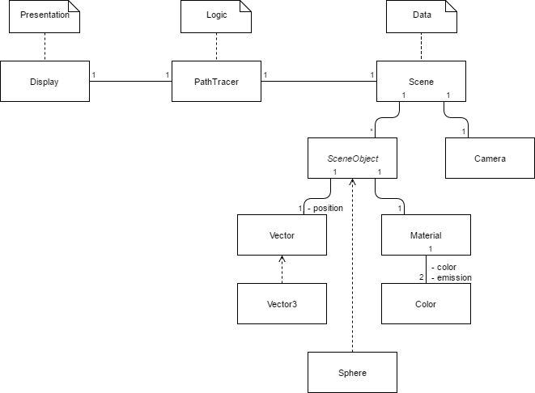
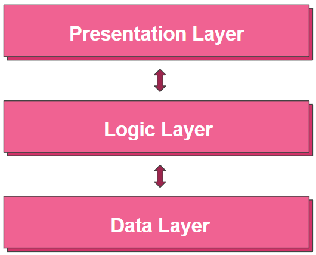

[](https://travis-ci.org/cpe305Spring17/spring2017-project-assumption) [](https://sonarqube.com/dashboard/index/Assumption%3AAssumption-JPTracer)

## Getting Started
First clone this repository.
```bash
$ git clone https://github.com/cpe305Spring17/spring2017-project-assumption.git
```

Then build the project with:
```bash
$ mvn clean install
```

And finally run the project with:
```bash
$ java -jar Assumption-JPTracer-3.0-SNAPSHOT.jar
```
or
```bash
$ mvn exec:java -Dexec.mainClass=base.Application
```

## Example Run
Shown is the result of the included base scene.


## Class Diagram
Here is a class diagram abstracted to demonstrate the overarching architecture of the project.



## Software Architecture Pattern
This project primarily subscribes to a three-tier architecture pattern including:
 * Presenation layer: This layer consists of what the user sees. Specifically the display includes a JFrame with a pixel map that is updated by the results of the path tracing in the logic layer.
 * Logic layer: This layer consists of calculations performed on the information in the data layer. The logic layer is also responsible for passing POJOs into the OpenCL kernel and retrieving the results.
 * Data layer: The information itself which is instantiated by parsing a formatted text file that specifies a scene.




## Design Patterns
### Singleton
The Singleton pattern was used to create the file parser and restricts the instantiation of the file parser class to one object.

## Bridge
The bridge pattern was used to create the Vector classes and interfaces and decouples abstract vectors from their concrete n-dimensional implementations.
